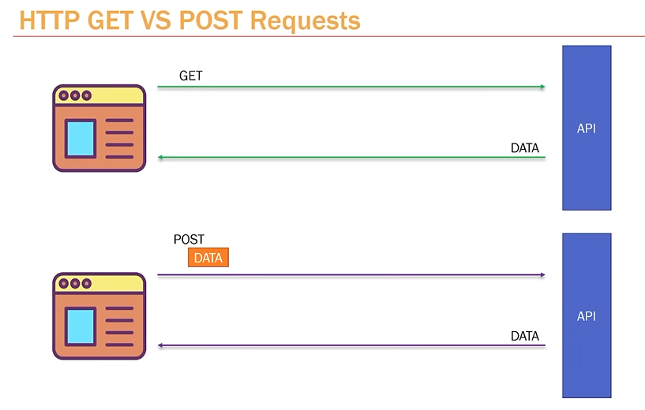

## Get and post requests 

-- post method
    @app.post("/createposts")
    def create_posts(payLoad: dict = Body(...)):
        print(payLoad)
        return {"message": "successfully created posts"}

    -- Body(...) = parameter of fastapi to extract data sent on the body

-- extracting and sending back to the user

    @app.post("/createposts")
    def create_posts(payLoad: dict = Body(...)):
        print(payLoad)
        return {"new_post": f"title: {payLoad['title']} content: {payLoad['content']}"}