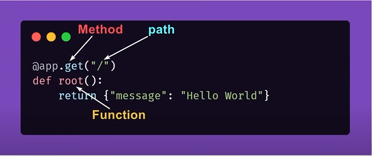

## path operations

@app.get("/")
async def root():
    return {"message": "Hello from server"}

@app.get("/")
def get_posts():
    return {"data": "This is your posts"}

-- As you can see both have same paths so they will stop wherever they
   they find the first match , so second one will be ignored
-- request search for two things : 'http methods' and 'url path'