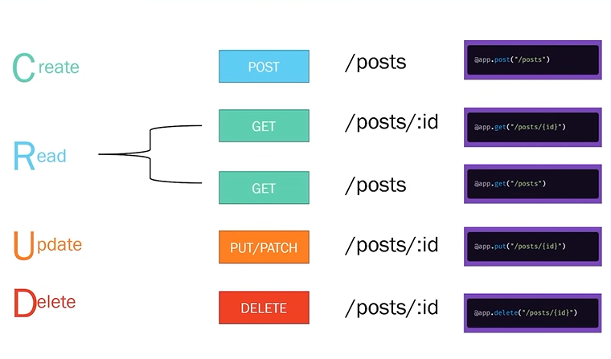

-- use plurals for the code conventions
   such as posts, users etc

-- now following all the code conventions
    such as for 'post' request changed the path to 'posts' instead of 
    'createposts'

-- as of now we are storing the data in memory, instead of db
    
    my_posts = [{"title": "title of post 1", "content": "content of post 1", "id":1},
            {"title": "title of favourite foods", "content": "I like pizzas", "id":2}]

    @app.get("/posts")
    def get_posts():
        return {"data": my_posts}
    
-- fastapi itself converts the array to json so, it could be sent upon the api

-- post request to create new post

    @app.post("/posts")
    def create_posts(post: Post):
        post_dict = post.model_dump()
        post_dict['id'] = randrange(0,100000000)
        my_posts.append(post_dict)
        return {"data": post_dict}

    {
        "data": {
            "title": "top beaches in florida",
            "content": "checkout the beaches",
            "published": true,
            "rating": null,
            "id": 9244839
        }
    }

## path parameter

@app.get("/posts/{id}")
def get_post(id):
    print(id)
    return {"post_detail" : f"Here is post {id}"}

-- id = is path parameter
-- and 'id' in arguements is directly extracted from path parameter

## showing post based on id

    def find_posts_by_id(id):
        for p in my_posts:
            if p["id"] == id :
                return p

    @app.get("/posts/{id}")
    def get_post(id):
        post = find_posts_by_id(id)
        return {"post_detail" : post}

 # it will not work as path parameter (id) is str, while posts index (id) is int so we have to convert the path parameter to int

      @app.get("/posts/{id}")
        def get_post(id):
            post = find_posts_by_id(int(id))
            return {"post_detail" : post}

 # but by doing this if we put anything other than int, it will try to convert to str, and provide 'Internal server errror' so instead we will put validation in arguements, so it self check as well as convert to int

    @app.get("/posts/{id}")
    def get_post(id: int):
        post = find_posts_by_id(id)
        return {"post_detail" : post}

   # response - http://localhost/posts/fjgjg
   {
    "detail": [
        {
            "type": "int_parsing",
            "loc": [
                "path",
                "id"
            ],
            "msg": "Input should be a valid integer, unable to parse string as an integer",
            "input": "dghj"
        }
    ]
}  

## order of apis

    @app.get("/posts/{id}")
    def get_post(id: int):
        post = find_posts_by_id(id)
        return {"post_detail" : post}

    @app.get("/posts/latest")
    def get_latest_post():
        post = my_posts[len(my_posts)-1]
        return {"detail": post}

here it is giving error:
{
    "detail": [
        {
            "type": "int_parsing",
            "loc": [
                "path",
                "id"
            ],
            "msg": "Input should be a valid integer, unable to parse string as an integer",
            "input": "latest"
        }
    ]
}

-- as fastapi is unable to differentiate b/w two, so flipping the order will make it work

## if post not found by that id

-- import "Responses" and "status"

    @app.get("/posts/{id}")
    def get_post(id: int, response: Response):

    post = find_posts_by_id(id)
    if not post:
        response.status_code = status.HTTP_404_NOT_FOUND
        return {'message': f"post with id {id} not found"}
    return {"detail": post}

## We can raise exception instead of manually writing

    @app.get("/posts/{id}")
    def get_post(id: int, response: Response):

        post = find_posts_by_id(id)
        if not post:
            raise HTTPException(status_code=status.HTTP_404_NOT_FOUND,detail=f"post with id {id} not found")
            
        return {"detail": post}

## when something is created, the status code should be 201

    @app.post("/posts", status_code=status.HTTP_201_CREATED)
    def create_posts(post: Post):
        post_dict = post.model_dump()
        post_dict['id'] = randrange(0,100000000)
        my_posts.append(post_dict)
        return {"data": post_dict}

## to delete

    - deleting post
    - find the index in the array that has required ID
    - my_posts.pop(index)

    @app.delete("/posts/{id}", status_code=status.HTTP_204_NO_CONTENT)
    def delete_post(id: int):
        index = find_index_post(id)

        if index == None:
            raise HTTPException(status_code=status.HTTP_404_NOT_FOUND, detail= f"post with id {id} doesn't exist")
        
        my_posts.pop(index)
        return Response(status_code=status.HTTP_204_NO_CONTENT)

## to update all fields = PUT

    @app.put("/posts/{id}")
    def update_post(id: int, post: Post):
        index = find_index_post(id)

        if index == None:
            raise HTTPException(status_code=status.HTTP_404_NOT_FOUND, detail= f"post with id {id} doesn't exist")
        
        post_dict = post.model_dump()
        post_dict['id'] = id
        my_posts[index] = post_dict
        return {'message': post_dict}
